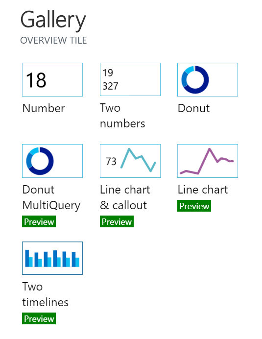

# <strong>Conversion Options</strong>

View Designer has a fixed static style of representation, while Workbooks enables freedom to include and modify how the data is represented, below depicts a few examples of how one might transform the views within Workbooks.

[View Designer - Vertical](https://go.microsoft.com/fwlink/?linkid=874159&resourceId=%2Fsubscriptions%2F5c038d14-3833-463f-a492-de956f63f12a%2Fresourcegroups%2Faul-rg%2Fproviders%2Fmicrosoft.operationalinsights%2Fworkspaces%2Faul-test&featureName=Workbooks&itemId=%2Fsubscriptions%2F5c038d14-3833-463f-a492-de956f63f12a%2Fresourcegroups%2Faul-rg%2Fproviders%2Fmicrosoft.insights%2Fworkbooks%2F5a0ba062-7246-4907-b03f-eed8b55bf1f7&workbookTemplateName=View%20Designer%20Vertical&func=NavigateToPortalFeature&type=workbook)

[View Designer - Tabbed](https://login.microsoftonline.com/common/oauth2/authorize?resource=https%3a%2f%2fmanagement.core.windows.net%2f&response_mode=form_post&response_type=code+id_token&scope=user_impersonation+openid&state=OpenIdConnect.AuthenticationProperties%3dkdC54YmE7U45paUQz9qkannO4vZj3msUAKTeRWYby-beEBvlBWBzPHaJKuf1OVwkpOLIBo1GK9U7AvC9kLLUSTUSexC3TPUe4Tq-D2clAusQAMSgRIF3HYunRcatZJ_ctL3S20uu4FIPqPcvVyRUAYzhytijw_h8JW7XiJnz8otWsRMx5RlpWjmsGxmnut53nlujrAbHFLnl3ohVQQ5SNB-dueVBjGtrHKuvMGlpdw7DMnaZX-m4pISVj2dqWcl2lCwcpnf3HA_zV3zhISBeYBghjC9wjF--j3I1VzVqGRd4IL4BMm4J8aEOyIV8tj0fvlYyQ-wGc5v0mH_aZ5PVYIX27qsVaCxgf7Xb4Hupz9w&nonce=637069316042813151.NzVjNmNlOTAtOWJmOC00NjgwLWEyNjAtZjk3N2NkNDFlMWMzOTYyNTdjM2MtNmE3ZC00NjEyLWE3ZDQtM2JhNThmMjc2YjYw&client_id=c44b4083-3bb0-49c1-b47d-974e53cbdf3c&redirect_uri=https%3a%2f%2fportal.azure.com%2fsignin%2findex%2f%3ffeature.refreshtokenbinding%3dtrue&site_id=501430&client-request-id=68b53221-915e-4075-8206-ac19537e81de&x-client-SKU=ID_NET&x-client-ver=1.0.40306.1554)

## <strong> Overview Tile Conversion</strong>
View Designer utilizes the overview tile feature to represent and summarize the overall state. These are represented in seven tiles, ranging from numbers to charts.

Within Workbooks, users can create similar visualizations and pin them to resemble the original style of overview tiles. 

## <strong> View Dashboard Conversion </strong>
View Designer tiles typically consist of two sections, a visualization and a list that matches the data from the visualization, for example the Donut & List

With Workbooks, we allow the user to choose to query one or both sections of the view. An example of how this view would be recreated in Workbooks is as follows:

In general, formulating queries in Workbooks is a simple two-step process. First, the data is generated from the query, and the second, where the data is rendered as a visualization. The next set of sections breakdown commonly utilized steps to recreate View Designer views within workbooks.
The goal of these next sections is to demonstrate how to re-create 1-1 mappings of View Designer views, however, learning the various options enables users to create their own custom views in Workbooks.
