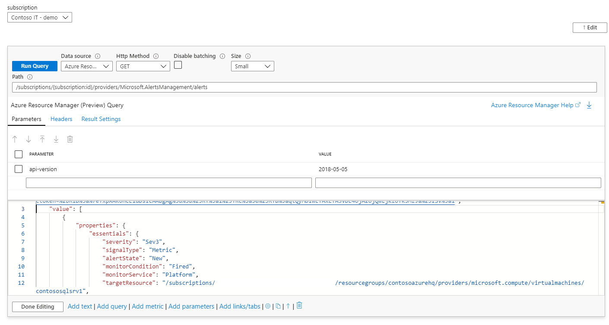
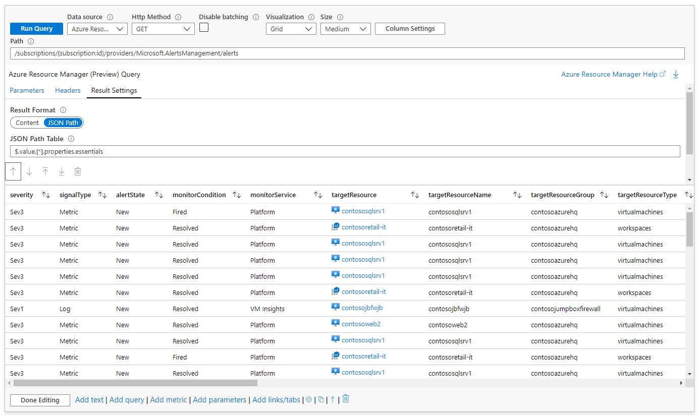
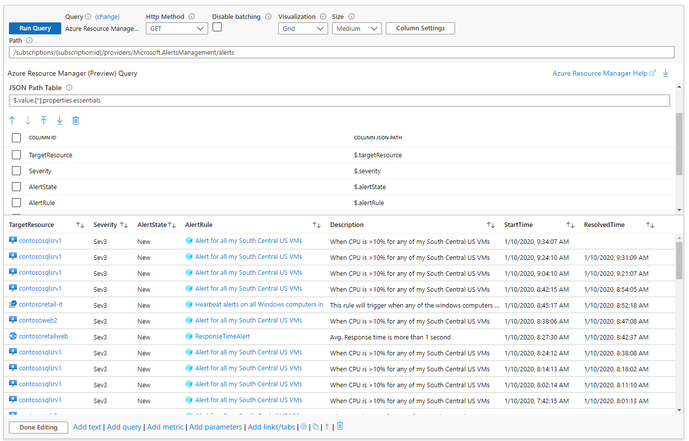

# Using Azure Resource Manager provider to retrieve alerts in a subscription

This sample shows you how to use the Azure Resource Manager (preview) query control to list all existing alerts in a subscription. This guide will also use JSON Path transformations to format the results.

## Setup parameters

1. Create an empty workbook.
2. Click `Add parameter` to create a new one. Use the following settings:
    1. Parameter name: `Subscription`
    2. Parameter type: `Subscription picker`
    3. Required: `Checked`
    4. Get data from: `Default Subscriptions`
    5. Use the `Save` button in the toolbar to save this parameter. 

To get a list of existing alerts for a subscription, we will utilize the [Alerts - Get All REST call](https://docs.microsoft.com/en-us/rest/api/monitor/alertsmanagement/alerts/getall)

3. Click `Add query` to create a query control.
    1. Data source: `Azure Resource Manager (Preview)`
    2. Http Method: `GET`
    3. Path: `/subscriptions/{subscription:id}/providers/Microsoft.AlertsManagement/alerts`
    4. Add the api-version parameter in the `Parameters` tab
        1. Parameter: `api-version`
        2. Value: `2018-05-05`
    5. Select a subscription from the created subscription parameter and click the `Run Query` button to see the results.
    
     This is the raw JSON results returned from Azure Resource Manager (ARM).

    

You may be satisfied with the information here. However, let us extract some interesting properties and format the response in an easy to read way.

4. Navigate to the tab `Result Settings`
5. Switch the Result Format from `Content` to `JSON Path`. JSON Path is a Workbook transformer. Click [here](../Transformations/JSONPath.md) to learn more about JSON Path in Workbooks.
6. In the JSON Path Settings - JSON Path Table: `$.value.[*].properties.essentials`. This extracts all "value.*.properties.essentials" fields from the returned JSON.
7. Click `Run Query` to see the grid.

JSON Path also allows you to pick and choose information from the generated table to show as columns. For example, if you would like to filter the results to the following columns: `TargetResource`, `Severity`, `AlertState`, `Description`, `AlertRule`, `StartTime`, `ResolvedTime`

8. Add the following rows in the columns table in JSON Path:

| Column ID | Column JSON Path |
| :------------- | :----------: |
| TargetResource | $.targetResource |
| Severity | $.severity |
| AlertState | $.alertState |
| AlertRule | $.alertRule |
| Description | $.description |
| StartTime  | $.startDateTime |
| ResolvedTime  | $.monitorConditionResolvedDateTime |

Click [here](https://docs.microsoft.com/en-us/rest/api/azure/) to see a list of other supported ARM calls.