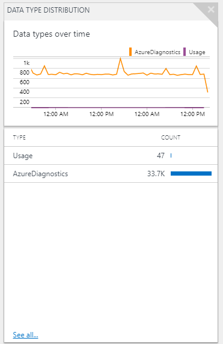
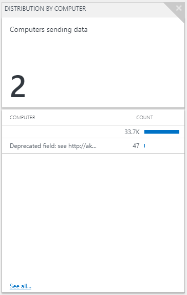
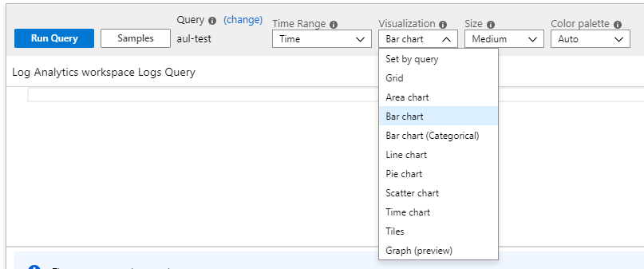

# Tile Conversions

## Donut & List
View Designer has the Donut & List tile as shown below:

Recreating the tile in workbooks involves two queries, for the Donut portion there are two options.\
Select **Add query** and paste the original query from View Designer into the cell

**Option 1:** Select Pie Chart from the Visualization Dropdown
 
**Option 2:** Add a line to the KQL\
**Add:** _| render piechart_\
Note that the Visualization setting should be set to **Set by query**
 
**Example:**\
**Original:** search * | summarize AggregatedValue = count() by Type | order by AggregatedValue desc \
**Updated:** search * | summarize AggregatedValue = count() by Type | order by AggregatedValue desc | render piechart

For creating a list and enabling sparklines please reference the section on [CommonSteps](./CommonSteps.md)

## Linechart & List
The original Linechart & List in View Designer looks like the following:
 
 

To recreate the Linechart portion we update the query as follows:\
**Original:** _search * | summarize AggregatedValue = count() by Type_\
**Updated:** _search * **| make-series Count = count() default=0 on TimeGenerated from {TimeRange:start} to {TimeRange:end} step {TimeRange:grain} by Type**_

There are two options for visualizing the line chart

**Option 1:** Select Line chart from the Visualization dropdown
 
 

**Option 2:** Add a line to the KQL
Add: | render linechart
Note that the Visualization setting should be set to Set by query

 

**Example:**
_search * | make-series Count = count() default=0 on TimeGenerated from {TimeRange:start} to {TimeRange:end} step {TimeRange:grain} by Type | render linechart_

For creating a list and enabling sparklines please reference the section on [Common Steps](./CommonSteps.md)

## Number & List
The original View Designer Number & List looks as such:
 
For the number tile, update the query as such:

**Original:** _search * | summarize AggregatedValue = count() by Computer | count_\
**Updated:** _search *| summarize AggregatedValue = count() by Computer **| summarize Count = count()**_

Then change the Visualization dropdown to Tiles
 
Select Tile Settings
 
From the sidebar menu,\
Set Visualization: Tiles\
Tile Settings: \
	Title: \
	Left -> Use Column: Count\
	Column Renderer: Big Number\

Advanced Settings \ Settings \ Chart title:  Computers sending data
 
For creating a list and enabling sparklines please reference the section on [Common Steps](./CommonSteps.md)

## Timeline & List
The Timeline & List in View Designer is shown below:

 

For the timeline simple update your query:

**Original:** _search * | sort by TimeGenerated desc_\
**Updated:** _search * **| summarize Count = count() by Computer, bin(TimeGenerated,{TimeRange:grain})**_

There are two options for visualizing as a bar chart
**Option 1:** Select Bar chart from the Visualization dropdown
 
**Option 2:** Add a line to the KQL
Add: | render barchart
Note that the Visualization setting should be set to Set by query
 

 
For creating a list and enabling sparklines please reference the section on [Common Steps](./CommonSteps.md)