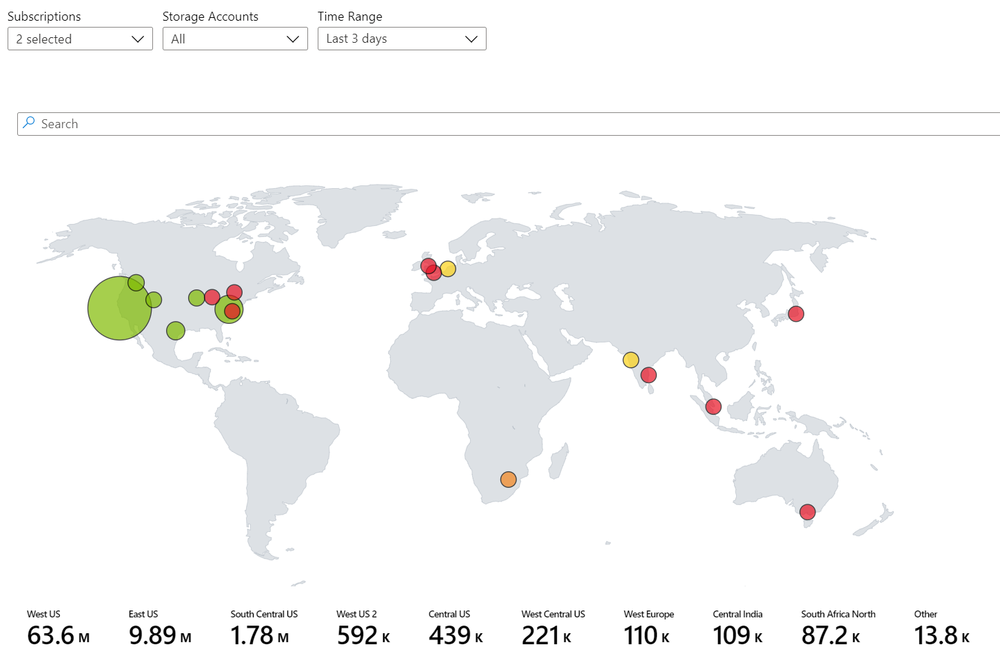

# Visualizations in Workbooks

Workbooks provide a rich set of capabilities for visualizing Azure Monitor data. The exact set of capability depends on the data source and result set, but authors can expect them to converge over time. These controls allow authors to present their analysis in rich, interactive reports. 

Workbooks support these kinds of visual components:
* [Text Step](Text.md)
* In Query / Metrics steps
    * [Charts](Chart.md)
    * [Grids](Grid.md)
    * [Tiles](Tiles.md)
    * [Trees](Tree.md)
    * [Honey Comb](HoneyComb.md)
    * [Graphs](Graph.md)
    * [Map](Map.md)
    * [Text](TextVisualization.md)

Use the links to learn more about each type of visualization.

Note: Each visualization and data source may have its own [limits](../DataSources/Limits.md).

## Examples
### Text Step

### Chart

### Grid

### Tile

### Tree

### Honey Comb

### Graph

### Map

### Text

